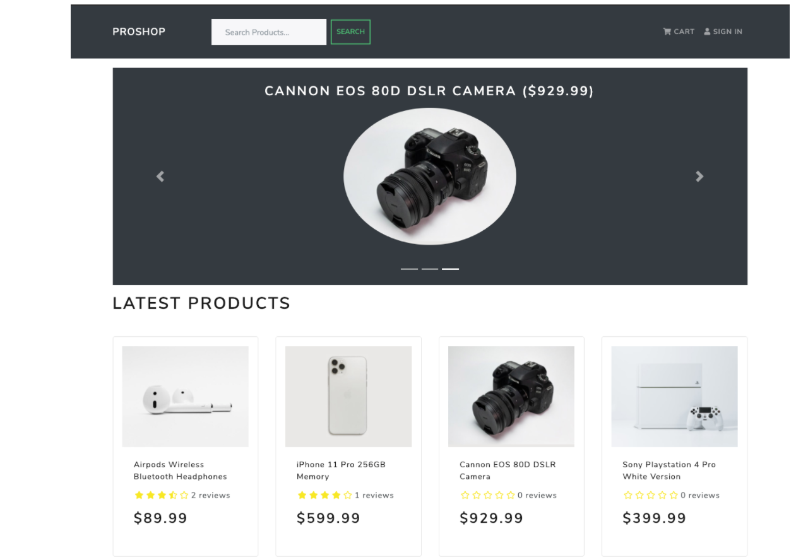

Customized eCommerce / shopping cart application

Features

Full featured shopping cart 
Product reviews and ratings 
Top products carousel 
Product pagination 
Product pagination 
Product search feature 
User profile with orders 
Admin product management 
Admin user management 
Admin Order details page 
Mark orders as delivered option 
Checkout process (shipping, payment method, etc) 
PayPal / credit card integration 
Database seeder (products & users) 

Env Variables
Create a .env file in then root and add the following

NODE_ENV = development
PORT = 5000
MONGO_URI = your mongodb uri
JWT_SECRET = 'abc123'
PAYPAL_CLIENT_ID = your paypal client id
Install Dependencies (frontend & backend)
npm install
cd frontend
npm install
Run

# Run frontend (:3000) & backend (:5000)

npm run dev

# Run backend only

npm run server
